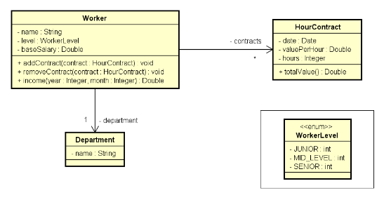

# Sistema de cadastro e consulta de funcionários

Programa de cadastro de funcionários e consulta de salário através de mês e ano do contrato.
Exercício proposto na aula sobre Composição do canal <https://devsuperior.com.br>

## 📦 Desenvolvimento
Enunciado do exercício: Ler os dados de um trabalhador com N contratos (N fornecido pelo usuário). Depois, solicitar
do usuário um mês e mostrar qual foi o salário do funcionário nesse mês.

## 🛠️ Construído com
Java 11
